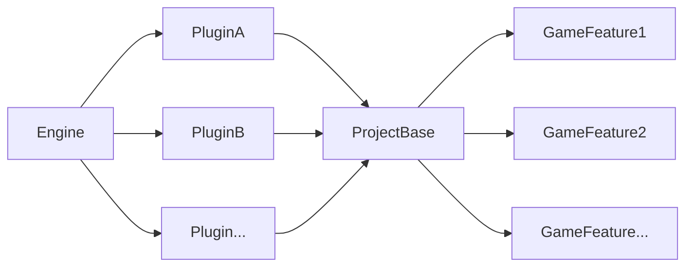
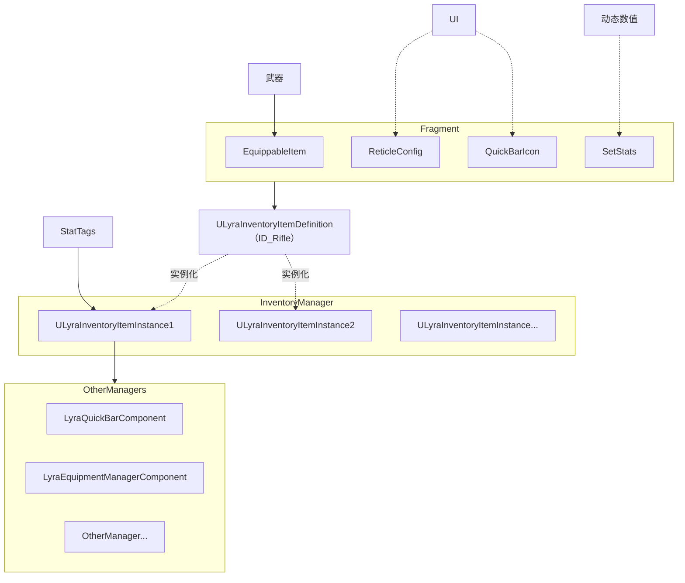
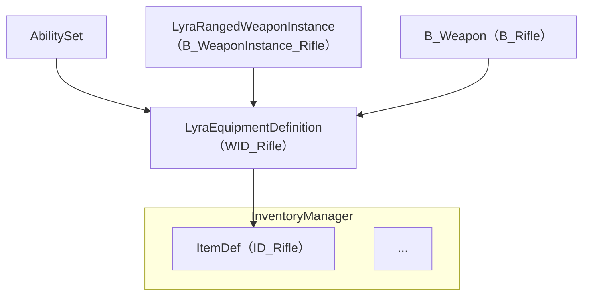

/\[title2list|list2lt]

# 总览

## 不错的资料

> \[!tip]- [Lyra源码为什么这么难-人宅](https://www.bilibili.com/video/BV1f95LzaEYY)
>
> 1. 很多新特性
> 2. GameFeature将Lyra做了极大的解耦、导致逻辑不连续，动态加载让引用关系很难查找
> 3. GAS+EnhanceInput
> 4. 大量使用DataAsset
> 5. 设计模式杂糅
> 6. 面向数据ECS的不严格使用\
>    系统+组件+实体
> 7. MVC用于UI\
>    数据模型+逻辑控制器+显示视图
> 8. MVVM和VUE：将逻辑和Btn分离的MVC
> 9. 堆栈式逻辑
> 10. Gameplay
> 11. 武器在有的地方像ECS，有的地方像MVVM
>     1. ECS——将武器的数据实例和表现做了分离，最终配置在Item中显示
>     2. MVVM——实例会被继续细分为Ability、蒙太奇、扩散\
>        
> 12. 开火射线检测的作用
>     1. 速度和碰撞会严重影响开火的命中检测
>     2. 散弹枪获取8个HitResult并上传到服务器广播

> \[!tip]+ [Lyra初学者游戏包工程解读 | quabqi](https://www.bilibili.com/video/BV1Ce4y1X7k5)

[InsideLyra-致UE“初学者”](https://zhuanlan.zhihu.com/p/1947044624603546090)\
非常全面和简洁地介绍了Lyra学习的前置知识和UE C++的核心要点:

[Lyra的部分程序设计简析](https://zhuanlan.zhihu.com/p/496143484)\
Lyra中除了框架外很容易被忽视的功能和优化:

[Lyra官方文档](https://dev.epicgames.com/documentation/zh-cn/unreal-engine/lyra-sample-game-in-unreal-engine)

## 关键信息简述

### Framwork

#### 核心价值

**GameMode的数据驱动替代**\
优点：

* **玩法模块化**(Experience)： 方便动态加载不同的玩法模式(第三人称射击，俯视角的竞技场派对游戏，横板平台跳跃等)
* **运行时组件化**(ModularGameplay)：解决因为Gameplay框架中类的数据和成员变量越来越多，最终会越写越大的问题
* **缓冲带**(GameFeatures)：隔离引擎Gameplay和项目的Gameplay，让一方的改动不会影响另一方。(作用不大)

#### 模块对比

**ModularGameplay**：运行时组件化——让Gameplay框架支持挂组件，GameFeature的前提\
**GameFeatures**：Mod化——让插件去依赖游戏主逻辑，不同玩法变成游戏Mod\
**Experience**：数据驱动——把组件和玩法框架封装并塞到数据表里，方便动态加载


#### 快速阅读框架

##### Modular Gameplay

让GameMode、GameState、PlayerState、Controller、Character拥有组件化能力\


SubSystem+Modular Gameplay就可以实现数据驱动

##### Game features

是Unreal Engine5引入的全新的类似于DLC的工作机制。



\


##### Experience

是Lyra项目自己引入的全新Gameplay侧的项目实现\
**算是GameMode的补充版本，它定义了更为高级的游戏规则和资源配置**。如：地图，UI，玩家输入，角色技能以及一些游戏规则等自定义的配置\
实现：虽然接管了一部分`GameMode`的职能，但由于资源和UI等内容需要同步给客户端，所以以GameStateComp的形式存在管理。\
\


### 3C

#### 核心

GamePlay相关Actor都是空壳，基本没有逻辑，只做转发路由。方便通过不同的类来挂Component\


#### 模块简述

**Character**：换装——将动画和模型分离。将属性单独放在HeroComp管理\
**Controller**：Enhance Input给输入和逻辑提供了中间层\
**Camera**：使用堆栈式管理相机模式，与原生SpringArm不相容，未封装CameraShake

#### 快速阅读框架

##### Character

###### Character结构


###### 换装Cosmetics

\


##### Controller

###### Controler重点


###### Input

在实际按键和逻辑中间加了Action层\


\
应用1：方便多输入设备\
应用2：与技能系统绑定\


应用3：实时更换配置\
开车时切换载具的Mapping\


###### AI行为树

比较传统的AI\
\
\


##### Camera

###### CameraMode

相机的堆栈式管理\
\


###### TPS相机

UE默认相机简化版\


### Animation

##### Anim重点


##### 多线程(线程安全函数)


##### Layers 分层

降低内存压力\
\
使用：\


##### LayerBlendPerBone

可以单独定义每个骨骼权重\


##### 动画回调函数

距离/运动匹配可以在动画的每一帧都处理逻辑\


##### CopyPose

直接拷贝父组件动画\


##### IK\_Rig

1. 替换Anim Retarget，通过骨骼链，UE5骨骼比UE4多出了很多骨骼实时解算：离线解算：

2. 实现可视化IK编辑

### 技能

\


数据化：\


死亡复活：触发技能时采用PayLoad传参\


### Weapon

##### Weapon架构图


##### 开火逻辑

\


##### 开火特效框架

**重点**：从外部传递参数给VFX\
\


### CommonUI

##### CommonUI重点


##### 堆栈式UI框架


##### HUD挂点

\


### 网络

#### 网络对战主要逻辑


## 学习路径

#### 基础

对Gamefeature中的大部分概念有个了解：

* \[x] [UE5 新项目Gameplay框架设计（以Lyra为例）](https://zhuanlan.zhihu.com/p/614718286) ✅ 2026-02-24
* \[ ] [Lyra核心概念（一）- Experience](https://zhuanlan.zhihu.com/p/648951586)\
  [《InsideUE5》GameFeatures架构（一）发展由来](https://zhuanlan.zhihu.com/p/467236675)\
  [《InsideUE5》GameFeatures架构（二）基础用法](https://zhuanlan.zhihu.com/p/470184973)\
  详细的参数说明:\
  [Lyra学习指南\_034\_GameFeature](https://zhuanlan.zhihu.com/p/1941143199772018564)\
  [Lyra的部分程序设计简析](https://zhuanlan.zhihu.com/p/496143484)\
  在Lyra中的应用：\
  [InsideLyra-选关](https://zhuanlan.zhihu.com/p/1947330381046064482)\
  [Lyra核心概念（一）- Experience](https://zhuanlan.zhihu.com/p/648951586)\
  [Lyra-Experience结构](https://zhuanlan.zhihu.com/p/1932435767143150372)\
  扩展Lyra:\
  [Lyra新增Experiences](/Lyra%E6%96%B0%E5%A2%9EExperiences)

#### 进阶

应用：\
[GameFeature——给你的游戏添加Mod支持](https://zhuanlan.zhihu.com/p/677160762)

# 玩法管理

## 地图加载

https://zhuanlan.zhihu.com/p/563434530

# 3C

## 角色

### 自身逻辑

#### 基础

流水账描述角色创建、死亡流程：[Lyra项目学习（二） 角色创建和死亡](https://zhuanlan.zhihu.com/p/563685231)\
详细介绍：[Lyra角色](/Lyra%E8%A7%92%E8%89%B2)

### 模型

### 动画蓝图

#### 基础

这篇文章对Lyra动画蓝图进行了全面准确的概括，并补充了需要了解的前置知识和概念：\
[白话Lyra动画系统](https://zhuanlan.zhihu.com/p/654430436)\
更详细的拆解：\
[Lyra动画系统拆解（基础移动篇）](https://zhuanlan.zhihu.com/p/628510656)

#### 知识点

FGameplayTagBlueprintPropertyMap，Tag到属性的自动映射机制，（自动将tag变化后的数量值更新到对应的属性中，自动转换为布尔，整型，浮点）简化蓝图的逻辑，提高动画蓝图的运行效率\


## 相机

\[timeline]

### 基本概念

[# 简述Lyra中的CameraMode摄像机框架](https://zhuanlan.zhihu.com/p/714058425)\
[# Lyra项目学习（六） 相机系统](https://zhuanlan.zhihu.com/p/602806113)\
[# 简述摄像机修改器(CameraModifier)的使用](https://zhuanlan.zhihu.com/p/714442062)

### 拓展

[# 在 UE5 Lyra 教程中创建相机模式体积](https://www.bilibili.com/video/BV1mR4y197n1)

## 控制器

[Lyra的GAS部分的映射-Input](https://blog.csdn.net/weixin_60486914/article/details/146323726)

# 库存

## 一段话总结

我们可以将库存分解为要处理的问题和解决方案。

* 框架需求
  1. 组件化、功能细分\
     将库存封装成组件(InventoryManagerComp)，其他管理器从总库存中引用，如QuickBar、WeaponBar。
  2. Item与不定量的其他系统高度耦合\
     Object实例化: `ULyraInventoryItemFragment`(DefaultToInstanced和Instanced)
* 网络需求
  1. 数组网络同步\
     `FastArray`: `FLyraInventoryList`,`FLyraInventoryEntry`
  2. Object网络同步\
     IsSupportedForNetworking\
     Iris: `ULyraInventoryItemInstance`
* 业务需求
  1. Item动态数值(耐久/子弹数)、动态词条\
     `ItemDefine`放静态数据\
     `TagContain`用Tag+TagCount存放动态数值\
     动态词条Lyra没有处理\
     ItemInstance=ItemDefine+TagContain
  2. Item堆叠个数\
     Entry里加个Count计数\
     Entry=ItemInstance+ItemCount

### 逻辑图



> 第二组Def/Ins：WeaponDefine和Instance与Item中的Def Ins实例无关，仅是组合关系

## 用到的技术

### Lyra库存系统框架

从背包的基本需求出发，方便新手视角理解: [Lyra 背包设计和可拓展方向](https://zhuanlan.zhihu.com/p/1922275287451832375)\
简单快速地了解概念和关键类: [ Lyra项目学习（三） 背包，装备，武器模块](https://zhuanlan.zhihu.com/p/598305282)

### Object Instanced:

概念:\
[Instanced介绍与简单使用](https://github.com/fjz13/UnrealSpecifiers/blob/main/Doc/zh/Specifier/UPROPERTY/Instance/Instanced/Instanced.md)\
应用:\
[在Gameplay Effect中的应用](https://zhuanlan.zhihu.com/p/657035214)\
[在数据表中实现Instanced效果](https://zhuanlan.zhihu.com/p/7349704909)

### FastArray

解决数组同步问题\
[简单使用](https://zhuanlan.zhihu.com/p/1920551237411136323)\
[FastArray浅析](https://zhuanlan.zhihu.com/p/653363240)\
[UE5 FastArray同步原理](https://zhuanlan.zhihu.com/p/638876315)

### Iris

新一代网络同步方案\
[官方文档](https://dev.epicgames.com/documentation/zh-cn/unreal-engine/introduction-to-iris-in-unreal-engine)

### 动态数据和动态词条

对未知名称和数量，用于其他系统的动态数据，用GameplayTagContainer可以很好地实现。\
动态词条Lyra并没有实现，[ 基于GAS的多人游戏装备系统开发](https://zhuanlan.zhihu.com/p/701181861)用EquipmentFeature实现

# 武器

## 框架

### 总结

* LyraEquipmentDefinition可以视为武器
  * B\_Weapon——模型和特效表现\
    其中开火特效被做成三个子Actor
    * B\_Weapon\_Fire——开火特效Actor
    * B\_Weapon\_Impact——击中特效Actor
    * B\_WeaponDecals——Niagara贴花Actor
  * LyraRangedWeaponInstance——所有数据
  * AbilitySet——能力集，表现效果从B\_Weapon取
    * 开火——GA\_Weapon\_Fire
    * 换弹——GA\_Weapon\_ReloadMagazine
    * 自动换弹——GA\_Weapon\_AutoReload

ItemDef中引用其连接库存系统，并添加表现库存相关的表现组件，子弹数量等实时数值由库存系统管理。

### 导图



### 文章

#### 入门

[Lyra 创建一个武器](https://zhuanlan.zhihu.com/p/661471302)

## 能力

武器核心需求是开火和换弹，部分需要瞄准。\
[武器射击流程](/%E6%AD%A6%E5%99%A8%E5%B0%84%E5%87%BB)

## 库存交互

### ULyraQuickBarComponent与ULyraEquipmentManagerComponent

每次切换武器时，武器蓝图都会被销毁和重新创建

```C++
FLyraEquipmentList::AddEntry
WID->ActorsToSpawn
```

# 主菜单

[官方文档介绍](https://dev.epicgames.com/documentation/zh-cn/unreal-engine/tour-of-lyra-in-unreal-engine)\
[Lyra游戏设置](https://dev.epicgames.com/documentation/zh-cn/unreal-engine/lyra-sample-game-settings-in-unreal-engine)

# 优化技术

## 整体

重要管理器

### ULyraSignificanceManager

大致是给已注册对象计算一个代表其重要性的值。\
其它系统可以根据这个值，来调整在此对象上的开销。\
比如角色视野内的对象，重要程度更高，应该以更高频率运行。

## 网络

### 角色加速度同步优化

通过[FLyraReplicatedAcceleration](https://zhida.zhihu.com/search?content_id=198385712\&content_type=Article\&match_order=1\&q=FLyraReplicatedAcceleration\&zhida_source=entity)结构体，只使用了3个字节，来同步角色的加速度。\
水平和竖直方向的加速度分别同步，\
水平方向使用极坐标同步“加速度方向”和"加速度大小"，\
竖直方向同步原始的加速度大小\
由于角色的最大加速度是已知的，所以"加速度大小"只用同步规格化的0.0 - 1.0的值，就能反推出当前加速度大小。\
然后将0.0 - 1.0用无符号整同步，分成256级，精度不高，但节省流量。\
竖直方向用有符号整数同步方向和大小，因此大小只有128级。\
相比三个轴向分别按原始值同步的方式，水平方向加速度使用极坐标同步的结果是：牺牲加速度方向的精度，换取加速度大小的精度。\
此同步结构体属性放在了角色上，因为按照惯例为了节省组件带来的同步开销问题，移动所需要同步的属性都是放在角色类上同步的。
